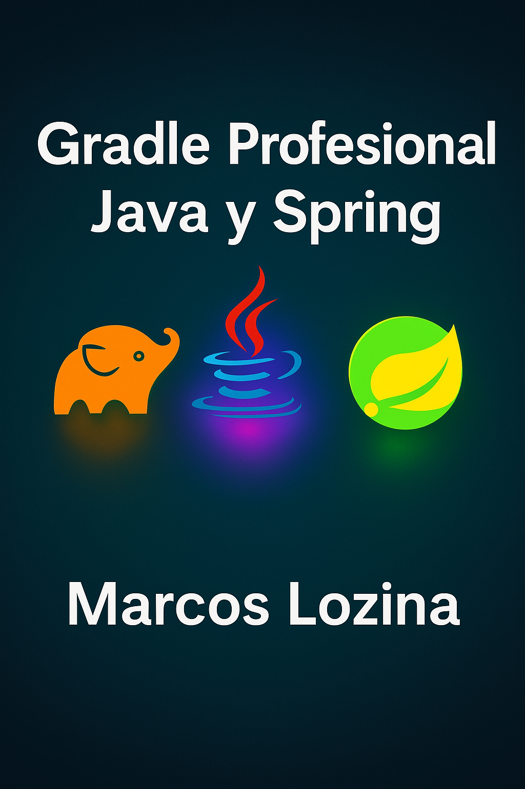

  

<h1 align="center">📘 Gradle Profesional con Java & Spring Boot</h1>

<em>Automatización, buenas prácticas y arquitectura moderna con Kotlin DSL</em>

---

## 👋 Bienvenido/a

Te doy la bienvenida a esta guía práctica y profesional sobre Gradle, orientada al desarrollo de proyectos Java modernos utilizando Spring Boot y Kotlin DSL.

Este eBook está pensado para desarrolladores/as que desean:

- ✅ Comprender las ventajas reales de usar Gradle en entornos empresariales.
- ✅ Adoptar buenas prácticas de configuración de proyectos.
- ✅ Optimizar builds en sistemas multimódulo.
- ✅ Automatizar dependencias, testing y releases.
- ✅ Integrar Gradle de forma efectiva con Spring Boot y herramientas modernas.

---

## 📚 ¿Qué vas a encontrar aquí?

Este material está estructurado en secciones teóricas y prácticas, con ejemplos reales, comandos listos para usar y conceptos aplicables directamente en tu trabajo diario.

> ✨ Ideal para quienes buscan profesionalizar su entorno de desarrollo y construir sistemas sólidos, escalables y automatizados.

---

## 🧑‍💻 Autor: **Lic. Marcos Lozina**

📅 Última actualización: **Mayo 2025**  
📩 Feedback o consultas: [marcoslozina@gmail.com](mailto:marcoslozina@gmail.com)

---
